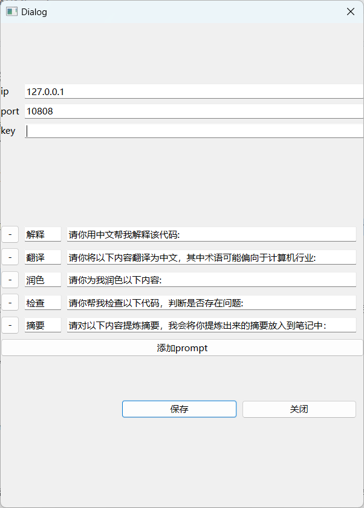

# Chatgpt-sidebar

这是一款致力于成为Windows上好用的划词软件，目前还处于Demo开发阶段，功能勉强可用。

## 代理设置

目前必须设置代理，且代理类型为socks5，需要填写IP和端口信息。

## API密钥

需要填写OpenAI的API密钥。

[查询你的密钥](https://platform.openai.com/account/api-keys)

## 使用指南
初次打开软件会弹出设置界面，如下图所示：

您需要填写IP、端口和API密钥，并且点击保存后关闭设置窗口。

初始会提供4个prompt，你可以直接更改名称和prompt

点击 添加prompt 按钮，会加一行，默认为 名称 提示语

当按钮名称为名称 或者 按钮的提示语为提示语时，点击保持将不会保存该功能呢按钮

然后随便选中一个文字，按下`ctrl c`会弹出侧边栏窗口：

在侧边栏中选择"关闭"，即可让设置生效。之后重新打开软件，再点击一次"设置"按钮，然后关闭设置窗口即可隐藏设置信息。

选中文本后，点击"翻译"或"解释"按钮即可使用功能，会自动附加上您的prompt向chatgpt提问。

点击侧边栏的隐藏按钮将会隐藏侧边栏，侧边栏在出现后10秒后会自动隐藏

点击设置按钮调出设置界面

## 警告
目前处于Demo开发阶段，欢迎您提供完善建议。

## SSE
Chatgpt的流式接口采用服务器推送（Server Sent Event）的方式驱动，具体实现细节请参考代码。本项目只使用了流式接口的部分功能。
