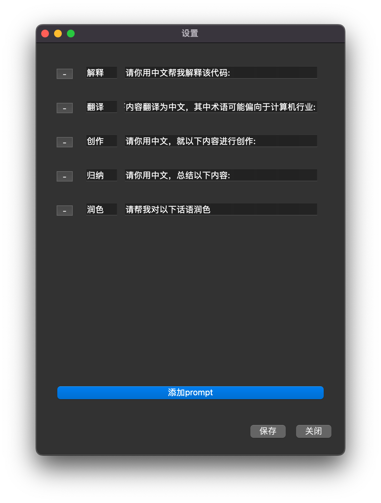
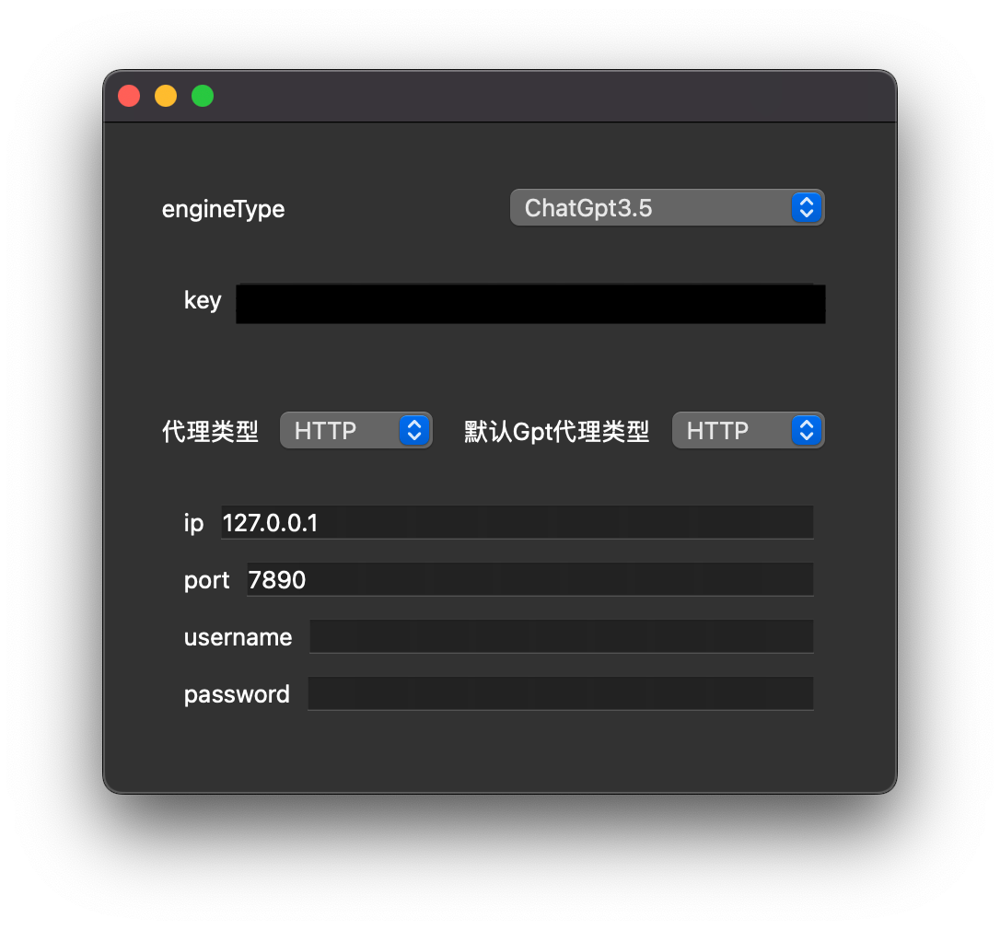
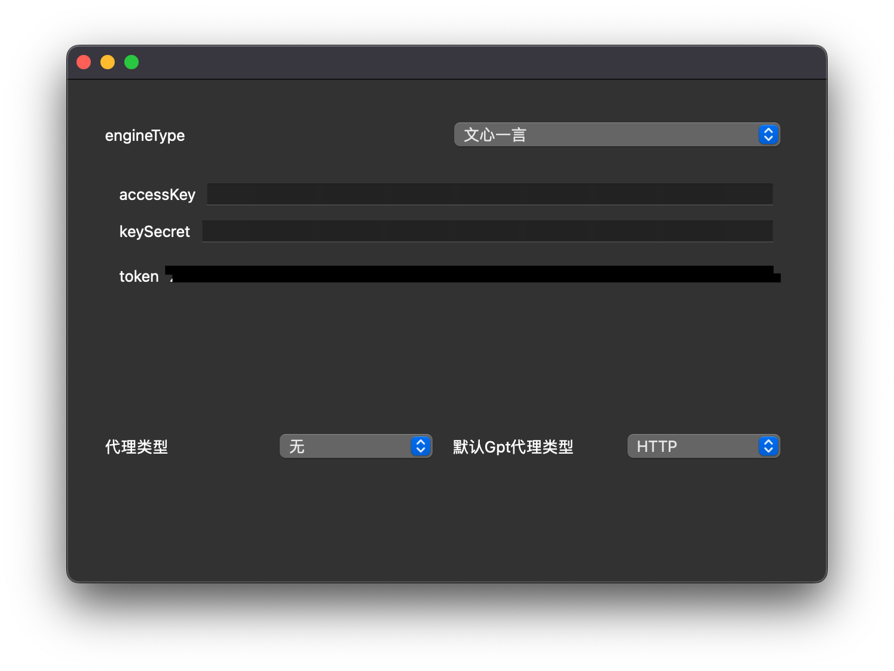
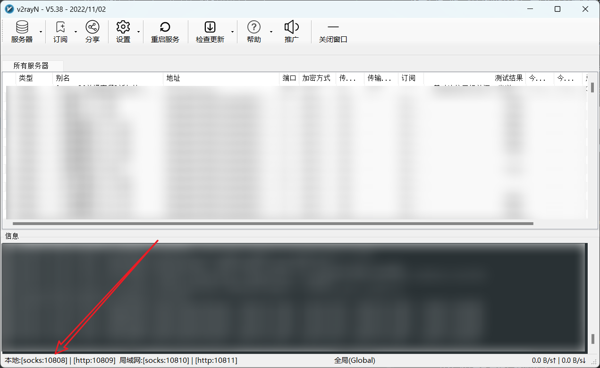
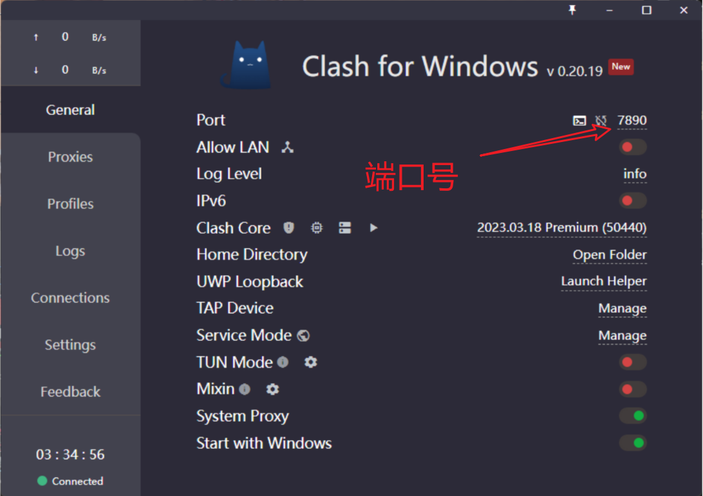

# Chatgpt-sidebar

## 项目简介
Chatgpt-sidebar 是一个为 Windows 设计的便捷划词翻译软件，目前仍处于 Demo 开发阶段。本软件提供了强大而实用的功能，旨在改善用户的文本处理体验。

## 代理设置
目前软件要求设置代理，并且仅支持 socks5 类型。您需要填写代理的 IP 地址和端口号。

## API 密钥
为了使用本软件，您需要填写 OpenAI 的 API 密钥。
[查询您的密钥](https://platform.openai.com/account/api-keys)

## 使用指南
首次打开软件时，会出现设置界面，如下图所示。在此界面中，您可以编辑提示词的按钮名称和提示语。
- 使用 "-" 号按钮可以删除一行。
- 使用 "添加prompt" 按钮可以添加一行。
- 当按钮名称为名称或提示语为提示语时，点击保持将不会保存该功能按钮。
- 配置在点击保存后生效，目前正在重构中。

设置界面包括 AI 引擎设置、代理设置等，配置完成后自动保存并生效。在电脑的任意位置选中可复制文本，按下复制键即可唤出 sidebar。

在 sidebar 中选择 "关闭"，即可让设置生效。之后重新打开软件，再次点击设置按钮，然后关闭设置窗口即可隐藏设置信息。

选中文本后，点击 "翻译" 或 "解释" 按钮即可使用功能，会自动附加您的 prompt 向 chatgpt 提问。

点击 sidebar 的隐藏按钮会隐藏 sidebar，sidebar 出现后 10 秒自动隐藏。

点击设置按钮调出设置界面。

## ip port
### v2rayN 
- 通常我们使用 v2rayN 进行代理，在本机上 IP 则填写 `127.0.0.1`，端口填写如箭头所指 `10808`。

### clash
- 对于 clash 代理，配置方式如下图所示。

目前，软件只支持 socks5 代理。

## 警告
软件目前处于 Demo 开发阶段，欢迎您提供完善建议。

## SSE
Chatgpt 的流式接口采用服务器推送（Server Sent Event）的方式驱动，具体实现细节请参考代码。本项目只使用了流式接口的部分功能。
